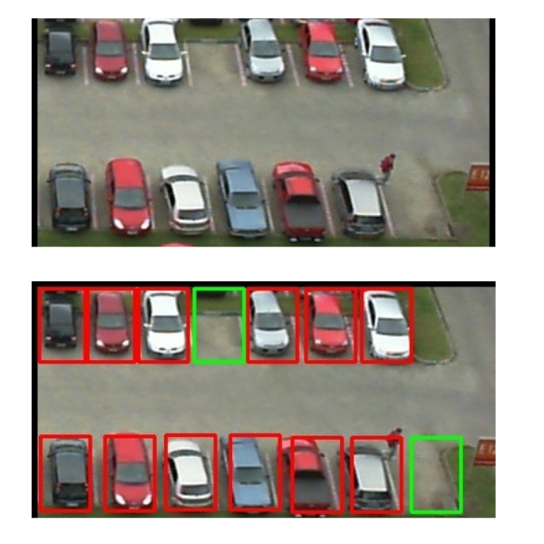
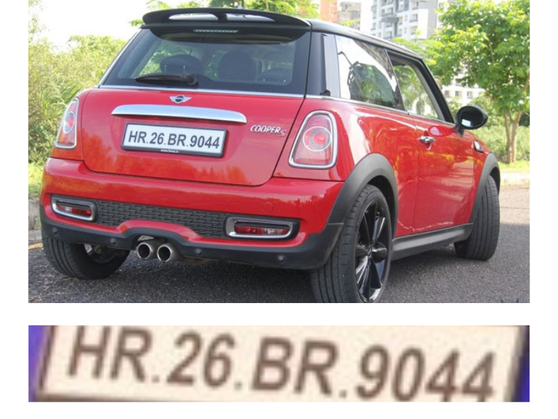

# Vehicle Number Plate and Parking Lot Occupancy Detection
Welcome to the Vehicle Number Plate and Parking Lot Occupancy Detection project documentation. This project utilizes computer vision techniques to detect vehicle number plates and analyze parking lot occupancy using image inputs. The application is built with Streamlit, providing a user-friendly interface for easy interaction with the detection models.

## Table of contents
- [Introduction](#Introduction)
- [Installation](#Installation)
- [Usage](#Usage)
- [Feature](#Feature)
- [Tools-Used](#Toolds_Used)
- [Future-Improvements](#Future_Improvements)

## Introduction

**This project serves two main purposes:**

1. **Vehicle Number Plate Detection:** This feature allows users to upload images of vehicles and extract the number plate information from them.

2. **Parking Lot Occupancy Detection:** Users can also upload images of parking lots to determine which spaces are occupied and which are available. Please note that the current model is specifically trained for a particular parking space, but it can be adapted for other environments with additional training data.

The application is built using Streamlit, providing a user-friendly web interface for interacting with the detection models.

## Installation

**To set up the project locally, follow these steps:**

1.**Clone the repository:**

```bash
    git clone https://github.com/your-username/your-repo-name.git
```

2.**Navigate to the project directory:**

```bash
    cd your-repo-name
```

3.**Install the required packages:**

```bash
    pip install -r requirements.txt
```
## Usage

**To run the Streamlit application, use the following command:**

```bash
     streamlit run app.py
```
Once the app is running, open your web browser and go to [http://localhost:8501.](http://localhost:8501.)    

**Parking Lot Occupancy Detection**

1. Navigate to the Parking Lot Occupancy Detection section .

2. Select an image from the provided test images folder.

3. The application will analyze the image and highlight the occupied and available parking spaces.

## Example Image


**Vehicle Number Plate Detection**

1. Go to the Vehicle Number Plate Detection section in the app.

2. Upload an image of the vehicle.

3. The application will process the image and display the detected number plate.

## Example Image


## Features

- **Vehicle Number Plate Detection:** Detects number plates from images of vehicles.

- **Parking Lot Occupancy Detection:**  Identifies occupied and available parking spaces in parking lot images.

- **Streamlit Interface:** Provides an intuitive web interface for uploading images and viewing results.

## Tools Used

**This project integrates the following tools and models:**

- **YOLO Model:** Utilized for detecting cars in images.

- **EasyOCR:** Implemented for recognizing text and numbers on license plates.

- **CNN Model:** Used to detect parking lot occupancy from images.

## Future Improvements

**Potential future enhancements for this project include:**

- **Real-Time Vehicle Detection:** Integrate real-time video feeds for dynamic vehicle number plate detection.

- **Real-Time Parking Lot Management:** Implement real-time monitoring to optimize parking space usage.

- **Scalability:** Extend the model to handle multiple parking lots simultaneously, suitable for larger-scale deployments.


